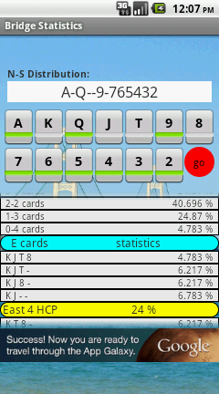
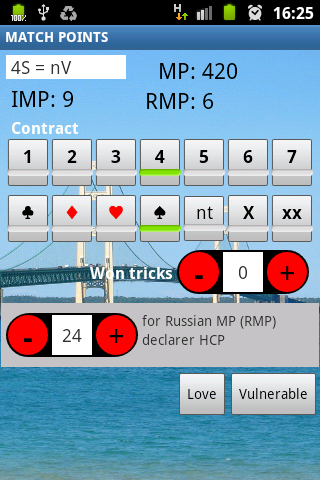

# bridgeStats
For Bridge players: calculates scores and statistics

"Now the general who wins a battle makes many calculations in his temple before the battle is fought. 
The general who loses a battle makes but few calculations beforehand. 
Thus do many calculations lead to victory, and few calculations to defeat: how much more no calculation at all! 
It is by attention to this point that I can foresee who is likely to win or lose." 
  Sun Tzu, The art of war.

In Bridge, the choice of a good strategy often depends on the correct evaluation of cards in hand to your opponents.

This evaluation is done trying to make the best use of all available informations: bidding, played cards, etc ..., but an essential starting point is the knowledge of a priori probabilities of the possible distributions.

The 'Bridge Stats' app examines all possible distributions of the cards of one suit in the opponent hands and calculates  their  probabilities.

  
'Bridge Stat' provides:
-   the probability of each individual distribution
-   the probabilities grouped by number of cards
-  the probabilities grouped by score. using HCP or ZHP and BP
-  the score of one played hand, in MP, IMP and RMP
